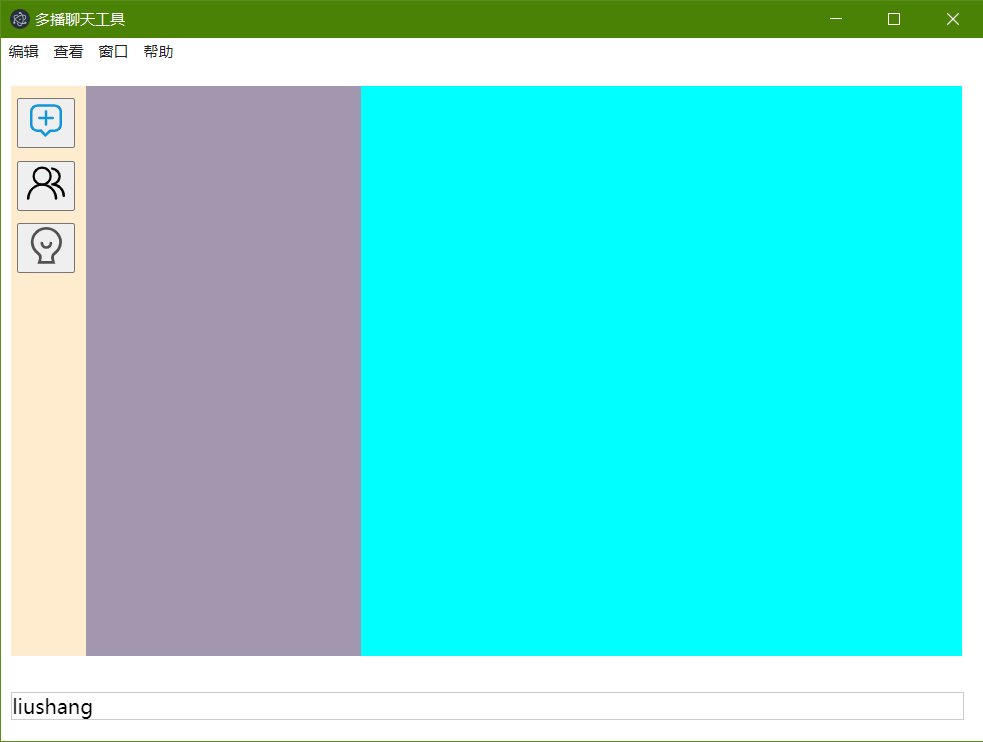
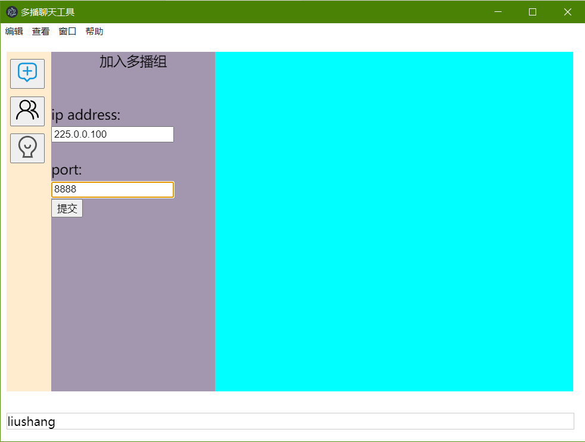
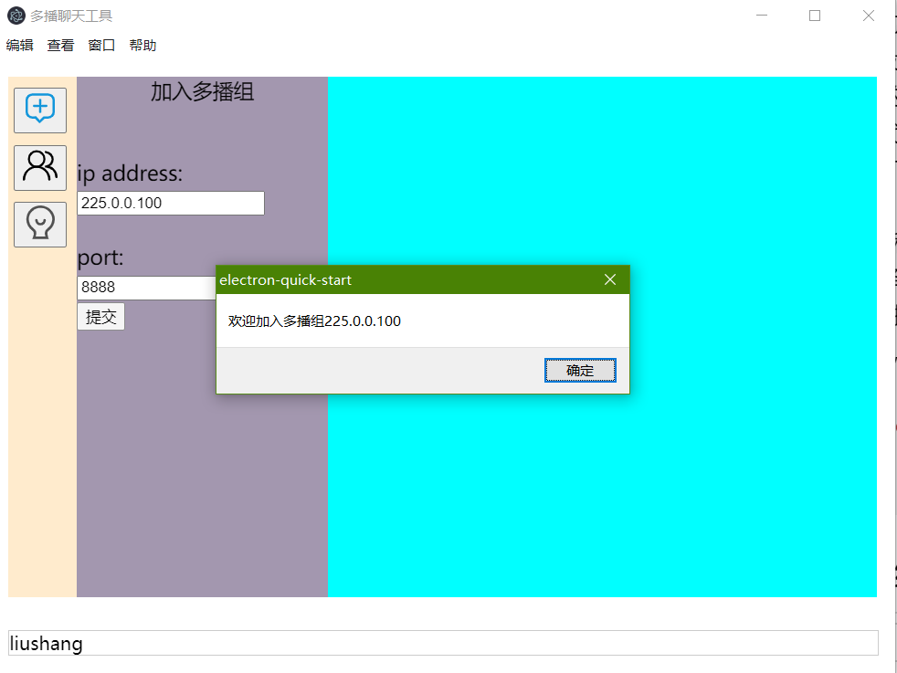
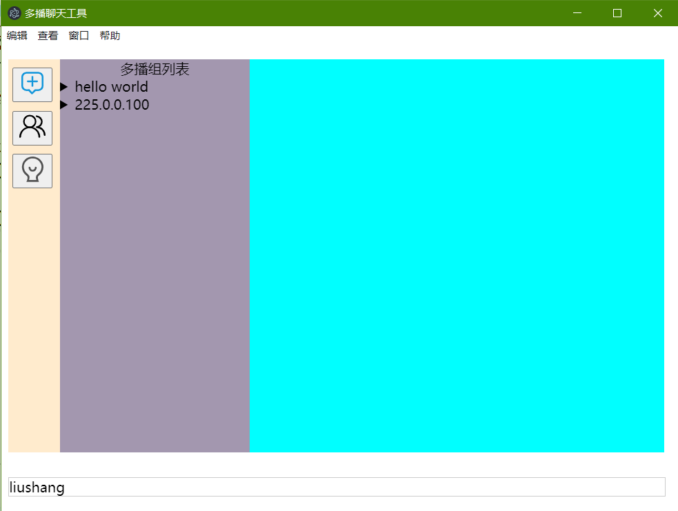

# <center>**高级网络编程实验报告**

### 实验名称：<u>**带有文件传输功能的多播聊天工具**</u></center>
### 实验日期：<u>**2020/6/23**</u>
### 学生姓名：<u>**李鑫**</u>
### 学生学号：<u>**71117409**</u>

## 一、实验目的
>1、深入理解udp原理，会使用udp进行通信。  
>2、掌握多播原理，会使用多播进行1-N通信。  
3、使用udp多播进行聊天文本传输。  
4、支持文件的传输，例如：源通过多播方式将文件（音视频）发送给多个接收方，接收方收到后，能够播放.  
5、能够对多播组成员进行管理（如何实现当前多播组成员的显示，删除等功能）；

## 二、实验环境
1、操作系统：`win10`

2、语言：`html5` `css3`  `javascript`

3、框架：`node.js v14.3.0` `electron v9.0.4`

4、工具：`jquery`
>jQuery是一套跨浏览器的JavaScript库，简化HTML与JavaScript之间的操作


## 三、实验内容
1. ### 设计思路
    + 需求分析：  
	1. 用户可以通过输入<B>多播组IP</B>和**端口号**来加入对应的多播组；  
	2. 用户可以**离开**指定的多播组；  
	3. 用户可以**查看**自己加入的多播组；  
	4. 用户可以查看每个**多播组中的成员**；  
	5. 用户可以将某个多播组中的某个成员加入**黑名单**，这样就可以让他收不到自己发的消息；  
	6. 用户可以将某个多播组的黑名单中的成员移出黑名单，这样对方就可收到自己的消息；  
	7. 用户可以在某个多播组中**发送消息**；  
	8. 用户可以在某个多播组中**发送文件**  
	9. 用户可以给自己起一个**名字**，其他人就可以通过名字来辨识自己；
	10. 用户可以更改自己的名字；
	11. 用户接受消息；
	12. 用户可以接收文件，并存放到**默认的文件夹**；
	13. 用户可以更改默认的接受文件的文件夹；
	14. 用户为了能够实现**非对称加密**，应该将公钥发送给组内的成员； 
	15. 用户可以通过自己的**私钥**进行**加密**，然后发送文件或者消息，收到的消息的用户可以通过**公钥**进行**解密**
	+ **设计**  
	**目标**：设计基于[node.js](https://nodejs.org)和[electron](https://www.electronjs.org/)简单易用的app  
	1、页面设计：  
	主页面如下图所示：
	
		* 上面为导航栏，能够对页面进行刷新，放大缩小等操作；
		* 中间主要分为三个部分，左侧边栏三个按钮，从上到下分别为加入多播组，显示多播组，以及个人中心，其功能分别为加入多播组，显示加入的多播组和多播组中的成员，显示多播组中成员发送的消息，以及对成员进行操作和发送消息和文件等。
		* 中间部分为操作部分，多播列表以及成员列表就在这个部分显示。
		* 右边蓝色部分为消息显示和发送部分
		* 下边框显示自己的名字以及其他个人信息  
  
	2、**功能设计**：  
	* 用户可以使用不同的端口加入一个多播组，所以对于多个端口的多播组应该视为一个多播组，所以在展示的时候不用重复展示，不同端口上的消息都归于这一个多播组。
	* **消息传输**：
		>**普通消息**  
		>**用户心跳消息**：1分钟发一次  
		>**用户离开消息**：退出多播组时发送  
		>**文件**
	* **用户检测**：  
		发送的消息格式：`$a+name+ip`当用户加入多播组时立即发送一次，以后每分钟发送一次，可以通过这种报文分析得到所有的正在活动的用户；  
		每5分钟对接收到的用户心跳信息进行查询，如果上次接收到的某个用户的心跳信息超过两分钟，则可以认为该用户已经下线，将该用户从自己的用户列表中删除；  
		通过该报文，还可以维护用户的名字，如果用户的名字发生了变更，则可以通过这个报文得到。
	* **用户离开**：  
		发送的消息：  `$b+name+ip`  接受到这个报文，可以将用户从自己的用户列表中删除
	* **文件**：` $f+filename+filesize+id+分割份数`
用来发送文件整体信息，以便接收者做好接受准备,`$f0+id+第一份文件`,`$f1+id+第二份文件`......发送文件内容
	* **文件传输**：由于udp报文的大小最大为64KB所以每个包不能太大，但是也不能够太小，太小会导致一个文件分解的包会比较多，如果一个包被丢弃，则整个文件就会传输失败。每个报文会带有一个独一无二的id用来区分不同文件，报文中还包含一个分组序号，用于确定重组时的顺序。
	* **文件校验**：  
  	每个报文中的文件都应该携带文件校验信息，以便于对这个报文的完整性进行校验，如果发现校验失败，则整个文件接受失败，当整个文件接收完成时，也要对整个文件进行完整性校验。
	* **用户管理**：将用户放进黑名单  
	这个本打算采用加密然后让用户无法解密的方式实现，但是感觉并不是很好，因为每拉黑一个人可能就要改加密方式，还要重新给每个用户发送密钥，很不方便。于是就采用了应用层屏蔽的方式，如果需要将某个人加入黑名单，则直接给该人发消息，使其将自己屏蔽，自己也将对方屏蔽，这样自己就不在他的逻辑用户列表内，不在逻辑用户列表中的用户发送的消息就不再接收，两个人就没办法再互相通信。另外还有一种方式：在发送消息中带上（不）能够接收该文件的用户列表，当接收者发现自己（不）在该列表才会接收报文，否则将报文丢弃。这两种方式都可以实现逻辑上的用户管理，但自我感觉也并不是很好。

	* **非对称加密**  
	用户将自己的公钥发送出去，接收到公钥的用户将公钥与对应的用户匹配存放，在以后接收到该用户的报文后用该公钥进行解密。  

	3、数据结构设计：
	```javascript
	mine = {
		LOCAL_IP: ip,
		name: "liushang",
		multicast_list: [
			{
				multicast_ip: "",
				port: [],
				socket: [] //socket类型
			},
		]
	};
	```
	存储个人信息，包含个人的名字，ip地址，加入的多播的信息
	```javascript
	var received_message = [
		{
			multicast_ip: "",
			multicast_ip_message: [
				{
					name: "",
					ip: "",
					msg: "",
					time: ""
				}
			]
		}
	]
	```
	存储消息记录，其中条消息记录包含发送者的名字，ip，消息内容，以及时间；

	```javascript
	var receving_files = [//当前正在接收的文件对象
		{
			filename: '',
			fileid: "",//文件标识
			file_number: 0,//文件总的块数
			current_number:0,//当前接收到的文件块数
			content: []//文件内容
		}
	]
	```
	用于存储临时文件，当用户接收到文件时，放进该对象。如果当前接收的文件块数达到了文件的总块数，将文件进行合并，并对合并后的文件进行校验，并将此对象中的临时文件清除。对于那些没有接收完的文件，长时间没有响应，可以认为这个文件传输失败，也要从该对象中清除掉，以免占用过多的资源。

	```javascript
		var multicast_members = [
		{
			multicast_ip: "",	//多播ip
			member: [			//成员对象列表
				{
					name: "",
					ip: "",
					if_logic: true
				}
			]
		}
	]
	```
	该对象用来维护多播中的成员信息，成员列表中的成员信息包含名字，IP地址，是否是逻辑组成员。

### 相关模块
#### [node.js](https://node.js.org)
>Node.js 是一个基于 **Chrome V8** 引擎的 JavaScript 运行环境。 Node.js 使用了一个**事件驱动****、非阻塞式 I/O** 的模型。  
Node对一些特殊用例进行优化，提供替代的API，使得V8在非浏览器环境下运行得更好。V8引擎执行Javascript的速度非常快，性能非常好。Node是一个基于Chrome JavaScript运行时建立的平台， 用于方便地搭建响应速度快、易于扩展的网络应用。Node 使用事件驱动， 非阻塞I/O 模型而得以轻量和高效，非常适合在分布式设备上运行数据密集型的实时应用。

##### os
os 模块提供了与操作系统相关的实用方法和属性  
该模块用来获取用户的私网ip地址

##### fs
fs模块提供了用于与文件系统进行交互（以类似于标准 POSIX 函数的方式）的 API。  
所有的文件系统操作都具有同步和异步的形式。  
异步的形式总是把完成回调作为其最后一个参数。 传给完成回调的参数取决于具体方法，但第一个参数总是预留给异常。 如果操作被成功地完成，则第一个参数会为 null 或 undefined。

##### dgram
dgram 模块提供了 UDP 数据包 socket 的实现。
通过该模块创建udp socket以及实现udp多播。
```javascript
const dgram = require('dgram');
const server = dgram.createSocket('udp4');

server.on('error', (err) => {
  console.log(`服务器异常：\n${err.stack}`);
  server.close();
});

server.on('message', (msg, rinfo) => {
  console.log(`服务器接收到来自 ${rinfo.address}:${rinfo.port} 的 ${msg}`);
});

server.on('listening', () => {
  const address = server.address();
  console.log(`服务器监听 ${address.address}:${address.port}`);
});

server.bind(41234);
// 服务器监听 0.0.0.0:41234
```
##### silly-datetime
该模块用来将获取到的时间进行格式化 `YYYY-MM-DD HH:mm
`的形式

#### [electron](https://electron.org)
>Electron（原名为Atom Shell）是GitHub开发的一个开源框架。**它允许使用Node.js（作为后端）和Chromium（作为前端）完成桌面GUI应用程序的开发**。Electron现已被多个开源Web应用程序用于前端与后端的开发，著名项目包括GitHub的Atom和微软的Visual Studio Code。
一个基础的Electron包含三个文件：**package.json**（元数据）、**main.js**（代码）和**index.html**（图形用户界面）。框架由Electron可执行文件（Windows中为electron.exe、macOS中为electron.app、Linux中为electron）提供。开发者可以自行添加标志、自定义图标、重命名或编辑Electron可执行文件。  
***主进程和渲染进程**  
Electron 运行 package.json 的 main 脚本的进程被称为主进程。 在主进程中运行的脚本通过创建web页面来展示用户界面。 一个 Electron 应用总是有且只有一个主进程。  
由于 Electron 使用了 Chromium 来展示 web 页面，所以 Chromium 的多进程架构也被使用到。 每个 Electron 中的 web 页面运行在它的叫渲染进程的进程中。  
在普通的浏览器中，web页面通常在沙盒环境中运行，并且无法访问操作系统的原生资源。 然而 Electron 的用户在 Node.js 的 API 支持下可以在页面中和操作系统进行一些底层交互。  
*主进程和渲染进程之间的区别*  
主进程使用 BrowserWindow 实例创建页面。 每个 BrowserWindow 实例都在自己的渲染进程里运行页面。 当一个 BrowserWindow 实例被销毁后，相应的渲染进程也会被终止。  
主进程管理所有的web页面和它们对应的渲染进程。 每个渲染进程都是独立的，它只关心它所运行的 web 页面。  
在页面中调用与 GUI 相关的原生 API 是不被允许的，因为在 web 页面里操作原生的 GUI 资源是非常危险的，而且容易造成资源泄露。 如果在 web 页面里使用 GUI 操作，其对应的渲染进程必须与主进程进行通讯，请求主进程进行相关的 GUI 操作。

##### remote
###### 在渲染进程中使用主进程模块。

**进程: Renderer**

remote 模块为渲染进程（web页面）和主进程通信（IPC）提供了一种简单方法。

在Electron中, GUI 相关的模块 (如  dialog、menu 等) 仅在主进程中可用, 在渲染进程中不可用。 为了在渲染进程中使用它们, ipc 模块是向主进程发送进程间消息所必需的。 使用 remote 模块, 可以调用 main 进程对象的方法, 而不必显式发送进程间消息, 类似于 Java 的 RMI 。

```javascript
//从渲染进程创建浏览器窗口

const { BrowserWindow } = require('electron').remote
let win = new BrowserWindow({ width: 800, height: 600 })
win.loadURL('https://github.com')
```

###### dialog=remote.dialog
>创建对话框，用于发送文件时选择文件的对话框

###### Menu = remote.Menu MenuItem = remote.MenuItem;
>右键弹出的菜单栏

#### [jquery](https://jquery.com/)
>jQuery是一个快速、简洁的**JavaScript框架**，是继Prototype之后又一个优秀的JavaScript代码库（或JavaScript框架）。jQuery设计的宗旨是“**write Less，Do More**”，即倡导写更少的代码，做更多的事情。它封装JavaScript常用的功能代码，提供一种简便的JavaScript设计模式，优化HTML文档操作、事件处理、动画设计和**Ajax**交互。
jQuery的核心特性可以总结为：具有独特的链式语法和短小清晰的多功能接口；具有高效灵活的css选择器，并且可对CSS选择器进行扩展；拥有便捷的插件扩展机制和丰富的插件。jQuery兼容各种主流浏览器，如IE 6.0+、FF 1.5+、Safari 2.0+、Opera 9.0+等。  
`const $ = require("jquery");`  
`$( "button.continue" ).html( "Next Step..." )`
   
## 四、实验结果分析及结论
### 加入多播组：
点击上面按钮：并输入ip地址和端口号

点击提交按钮

多播加入成功  

多播列表展示(hello world为测试用)：

可以看到成功加入了多播组225.0.0.100


